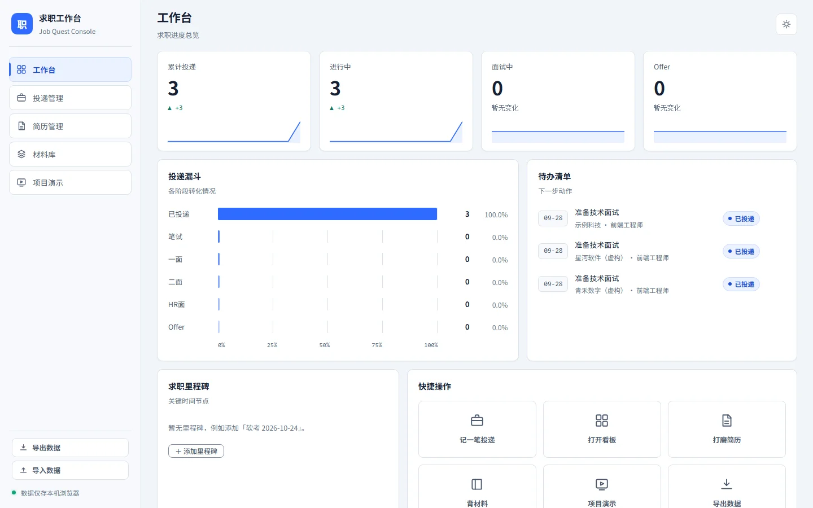
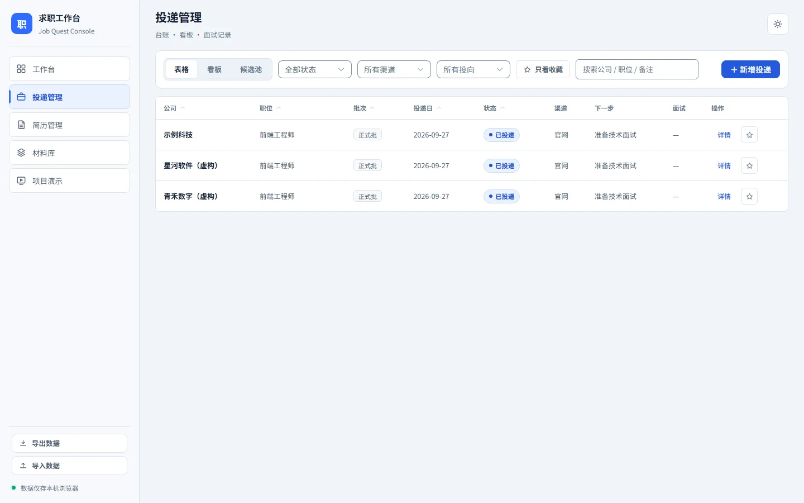
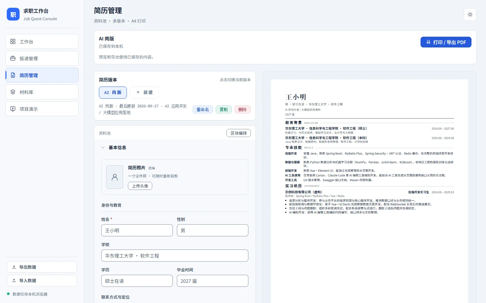
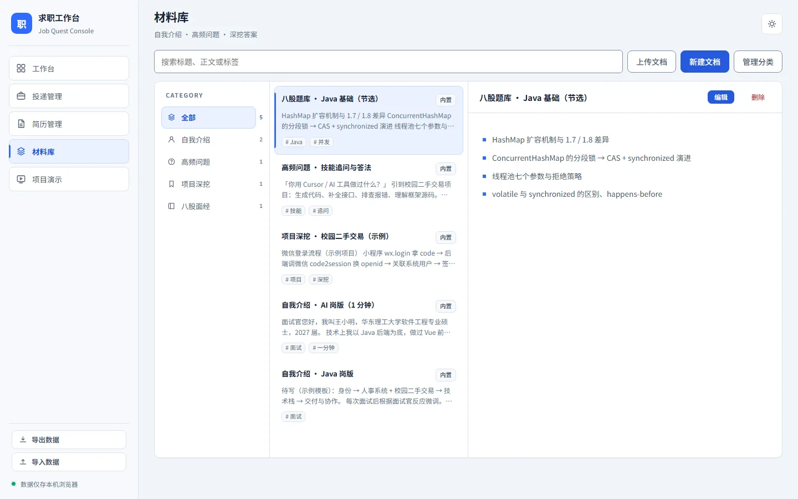
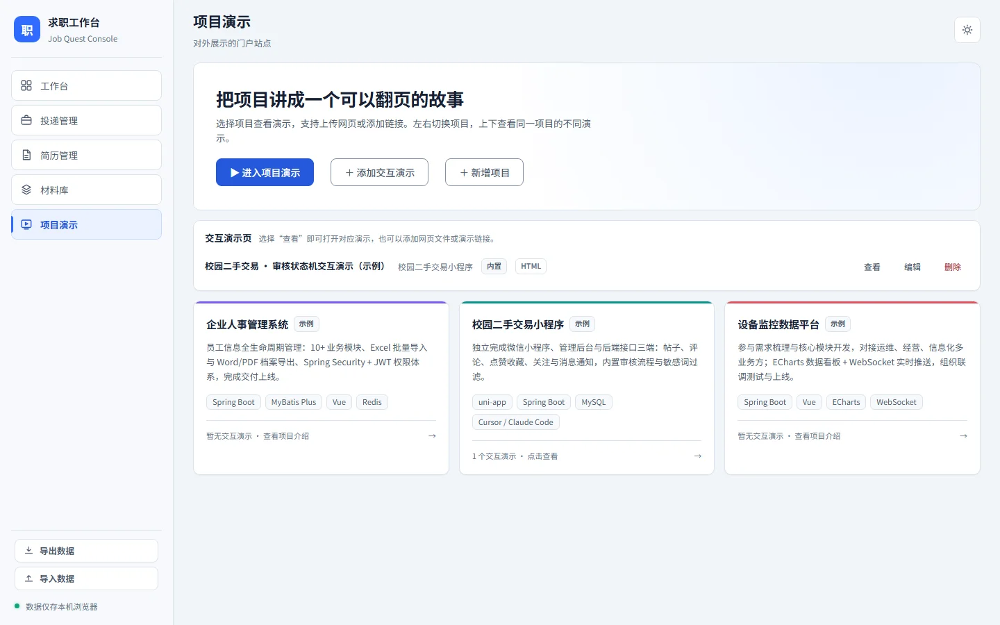
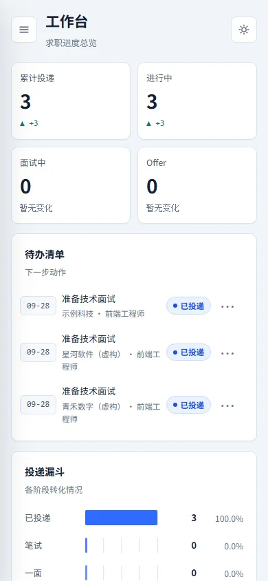

# 求职工作台

一个把投递跟踪、简历编辑、求职材料和项目演示放在一起的纯前端工具。

[在线体验](https://mrchen-hero.github.io/job-console/) · [使用教程](#第一次使用) · [部署到自己的站点](#一键部署) · [反馈问题](https://github.com/MrChen-hero/job-console/issues)

[](https://github.com/MrChen-hero/job-console/actions/workflows/ci.yml)
[](https://github.com/MrChen-hero/job-console/actions/workflows/deploy-pages.yml)

它不需要账号和后端服务。你的简历、投递记录、面试记录和材料只保存在当前浏览器的 IndexedDB 中，支持 JSON 导出和导入。

> 适合个人使用、作品集展示和二次开发。默认示例数据是虚构内容。

## 页面一览

| 工作台 | 投递管理 |
|---|---|
|  |  |

| 简历管理 | 材料库 |
|---|---|
|  |  |

| 项目演示 | 移动端 |
|---|---|
|  |  |

## 能做什么

- **工作台**：查看投递总数、进行中阶段、Offer、漏斗和待办；待办可以完成、编辑、延期或直达投递详情。
- **投递管理**：用表格或看板管理投递，记录渠道、投向、岗位信息、阶段历史和面试纪要。
- **简历管理**：建立多个独立简历版本，编排区块和条目，上传并重裁头像，预览 A4 分页并打印为 PDF。
- **材料库**：管理自我介绍、常见问题和项目深挖材料；支持 Markdown、搜索、标签和自定义分类。
- **项目演示**：管理项目卡片，上传单文件 HTML 或添加 HTTP(S) 演示链接，在双轴 Deck 中展示项目和交互页面。

## 数据与隐私

- 应用本身没有后端，不会把本地数据上传到项目维护者的服务器。
- 数据保存在浏览器 IndexedDB。清理浏览器站点数据、换浏览器或使用隐私窗口可能导致数据不可用。
- 换设备前，请在侧边栏使用「导出数据」；在新设备使用「导入数据」恢复。
- 导入支持合并和覆盖。覆盖前会自动保存快照，最多保留 5 份。
- Markdown 正文和演示要点会清理危险 HTML；上传的交互 HTML 在沙箱 iframe 中运行。
- 你主动添加的外部演示链接会由浏览器访问第三方站点，这部分请求遵循对方网站的隐私政策。

不要把真实简历、电话、邮箱或投递记录提交到 Git 仓库。许可证见 [LICENSE](LICENSE)。

## 本地运行

使用 Node.js 24.x；仓库通过 `.node-version` 和 `package.json` 固定主版本。

```bash
git clone https://github.com/MrChen-hero/job-console.git
cd job-console
npm ci
npm run dev
```

开发服务器默认地址为 <http://localhost:5173>。

常用命令：

```bash
npm run dev        # 启动开发服务器
npm run build      # 类型检查并构建 dist/
npm run preview    # 预览构建产物
npm run lint       # ESLint
npm run test:run   # Vitest 单元测试
npm run test:e2e   # Playwright 端到端测试
npm run shots      # 开发服务器运行时生成 README 截图
```

生成截图前先运行 `npm run dev`，然后在另一个终端执行 `npm run shots`。脚本只使用虚构数据，图片写入 `docs/screenshots/`。

首次运行截图或端到端测试前，执行 `npx playwright install chromium` 安装测试浏览器。截图使用独立临时浏览器，不读取或清空日常浏览器数据。

## 一键部署

项目是静态 Vite 应用，构建输出目录统一为 `dist`，使用 Hash 路由，因此不需要额外的服务端重写规则。

### GitHub Pages

推送 `main` 分支后，GitHub Actions 会执行质量检查、构建并发布 Pages。

1. 打开仓库 Settings → Pages。
2. 将 Source 设置为 GitHub Actions。
3. 推送 `main`，等待 [Deploy GitHub Pages workflow](.github/workflows/deploy-pages.yml) 完成。

### Vercel

[](https://vercel.com/new/clone?repository-url=https://github.com/MrChen-hero/job-console)

```text
Install command: npm ci
Build command: npm run build
Output directory: dist
Node.js: 24
```

仓库中的 [vercel.json](vercel.json) 包含构建设置，Node 版本由 `package.json` 指定。按钮会引导登录、复制仓库和创建站点；首次部署仍需平台授权。

### Cloudflare Pages

在 Cloudflare Pages 中选择「Connect to Git」：

先 Fork 本仓库，再从 Workers & Pages 中选择创建 **Pages** 项目并连接你的仓库；这是 Git 导入流程，不是 Workers 部署按钮。

```text
Framework preset: Vite
Build command: npm run build
Build output directory: dist
Node.js: 24
```

在构建环境中设置 `NODE_VERSION=24`。构建命令在 Pages 控制台配置，`wrangler.toml` 只声明项目名、兼容日期和输出目录，不执行构建。CLI（命令行工具）部署使用：

```bash
npm ci
npm run build
npx wrangler login
npx wrangler pages deploy dist
```

### Netlify

[](https://app.netlify.com/start/deploy?repository=https://github.com/MrChen-hero/job-console)

```text
Build command: npm run build
Publish directory: dist
Node version: 24
```

对应配置见 [netlify.toml](netlify.toml)。

更换域名、协议或端口后，浏览器会使用另一份本地数据库。迁移站点前导出备份，再在新地址导入；发布网站不会发布你的本地简历和投递数据。

## 第一次使用

1. 打开「简历管理」，点击「一键填入示例资料」了解编辑和预览布局，再替换为自己的资料。
2. 在「简历版本」中创建面向不同岗位的版本；每个版本都有独立资料池。
3. 在「投递管理」中新增一条投递，填写公司、职位、渠道和下一步动作。
4. 通过阶段流转记录笔试、面试、Offer 或挂起状态；面试抽屉可以保存问题和复盘。
5. 在「材料库」中上传 Markdown，或直接新建材料，并用分类和标签整理。
6. 在「项目演示」中编辑项目卡片，上传单文件 HTML 或填写自部署演示链接。
7. 定期从侧边栏导出 JSON 备份。恢复数据时先确认当前库和备份数量，再选择合并或覆盖。

## 项目结构

```text
src/storage/       Dexie 数据库、实体类型、备份校验和快照
src/shared/        布局壳、通用 UI、Markdown 工具和导入导出
src/app/           路由、导航、主题和入口装配
src/modules/       dashboard、tracker、resume、library、showcase 业务模块
src/content/       编译时内置 Markdown 和交互演示
src/config/        内置项目展示配置
src/styles/        Cool Slate 设计令牌和全局样式
tests/e2e/         Playwright 端到端测试
```

更完整的架构约定见 [AGENTS.md](AGENTS.md)，视觉设计见 [DESIGN.md](DESIGN.md)，已知限制见 [docs/tech-debt.md](docs/tech-debt.md)。

## 开发与贡献

提交修改前建议执行：

```bash
npm run lint
npm run test:run
npm run build
npm run test:e2e
git diff --check
```

Pull Request 会自动执行 lint、单元测试、构建和 E2E。请不要提交真实个人资料、导出的备份、浏览器测试产物或包含本机路径的截图。

贡献步骤见 [CONTRIBUTING.md](CONTRIBUTING.md)，安全问题见 [SECURITY.md](SECURITY.md)。`private: true` 仅防止误发到 npm，不影响 MIT 授权和自行部署。

## 已知限制

- 数据只在当前浏览器中，不提供账号登录和云同步。
- 浏览器禁用 IndexedDB 时，读取和保存可能失败；应用没有内存存储兜底。建议使用普通窗口并定期导出备份。
- 外部演示页面是否允许被 iframe 嵌入取决于对方站点的响应头；页面提供新标签打开入口。
- 简历分页按内容块切分，单个内容块超过一页时不会从中间截断。
- 内置演示页会随前端构建产物发布，数量较多时会增加初始资源体积。

## 许可证

本项目使用 [MIT License](LICENSE)。
